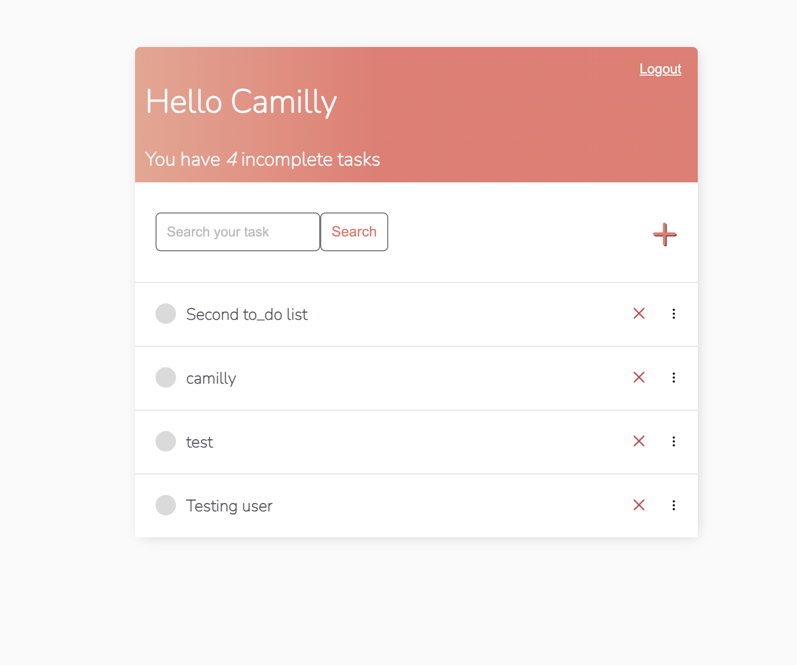
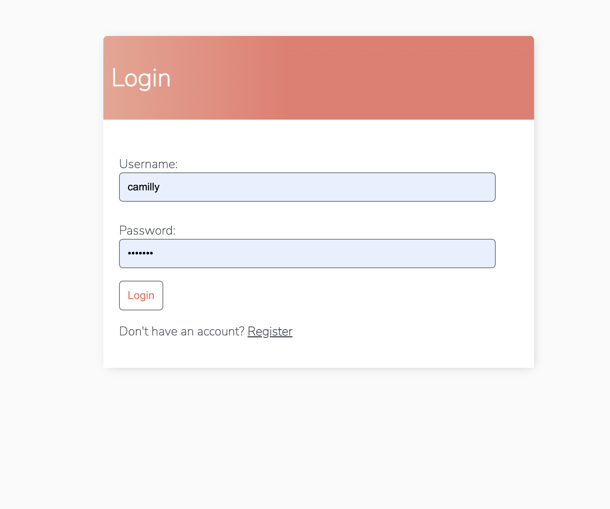
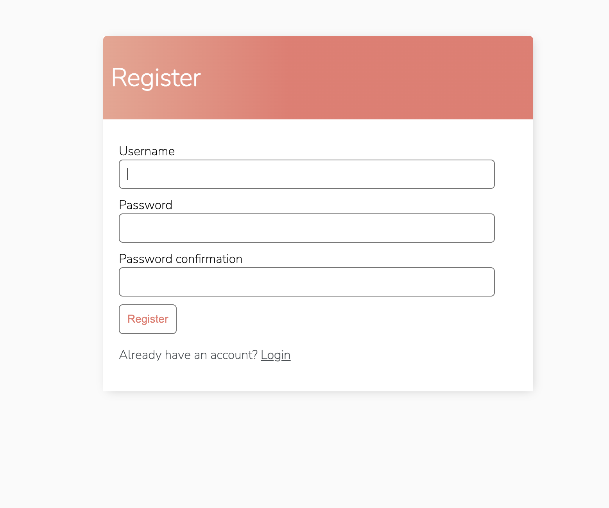

# My To-Do List Application

This project is a simple and user-friendly To-Do List application built using Django for the backend and HTML/CSS for the frontend. The application allows users to register, log in, create, update, and delete tasks. Tasks can be marked as complete, and users can search for tasks and reorder them. The application also includes user authentication, ensuring that each user has access only to their own tasks.

## Features

- **User Authentication**: Register, log in, and log out functionality.
- **Task Management**: Create, update, delete, and view tasks.
- **Task Reordering**: Drag and drop to reorder tasks.
- **Task Filtering**: Search functionality to filter tasks.
- **Responsive Design**: Mobile-friendly layout.

## Technologies Used

- **Backend**: Django
- **Frontend**: HTML, CSS, JavaScript
- **Database**: SQLite (default for Django)
- **Authentication**: Django's built-in authentication system

## Setup Instructions

1. **Clone the Repository**
   ```bash
   git clone https://github.com/your-username/your-repo-name.git
   cd your-repo-name

## Screenshots

Here are some screenshots of our project:







## Acknowledgments
Thank you to Dennis Ivy. I learned this from his tutorials on [Dannis Ivy](https://www.youtube.com/@DennisIvy), and it was really helpful for me.